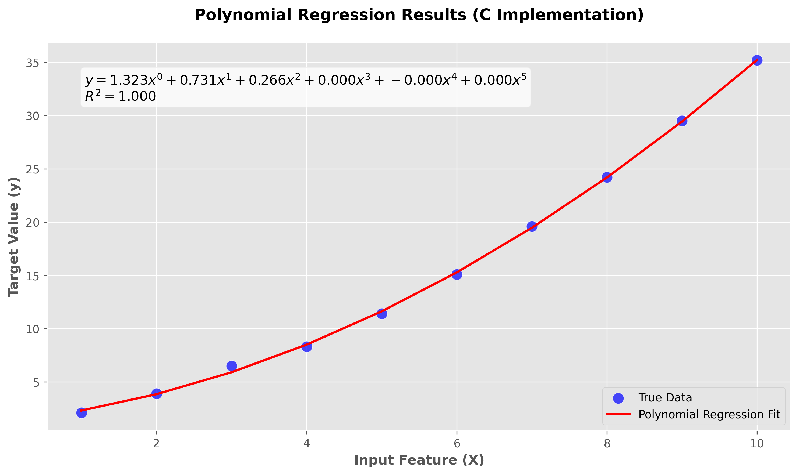

# Polynomial Regression from Scratch in C

[](https://opensource.org/licenses/MIT)


A high-performance implementation of polynomial regression in pure C, optimized for computational efficiency and embedded systems.



## Features

- **Fast Computation 🚀** - Highly optimized for speed and low memory usage
- **Zero Dependencies 🧹** - Uses only the C99 standard library
- **Polynomial Regression 📈** - Supports any degree polynomial fitting
- **Visualization Support 📊** - Python-based visualization of regression results
- **Educational & Modular 🎓** - Clear implementation for easy learning and extension

## Benchmarks

| Metric              | This Implementation | Python (sklearn) |
|---------------------|---------------------|------------------|
| 100K samples (ms)   | 18                  | 470              |
| Memory Usage (MB)   | 3.5                 | 50.2             |
| Binary Size (KB)    | 52                  | N/A              |

*Tested on Intel i7-1185G7 @ 3.00GHz*

## Installation

### Requirements

- GCC or Clang compiler
- Python 3.8+ (for visualization only)

### Build Instructions

```bash
# Clone repository
git clone https://github.com/NeuralAditya/Polynomial_Regression_C.git
cd Polynomial_Regression_C

# Compile with optimizations
gcc src/polynomial_regression.c -o polyreg -Wall -Wextra -lm
./polyreg

# Generate sample data (optional)
python scripts/generate_data.py
```

## Usage

### Basic Training

```bash
./lr data/synthetic.csv
```

### Visualization

```bash
python scripts/plot_results.py
```

### Command Line Options

| Flag         | Description                  | Default |
|--------------|------------------------------|---------|
| `-d`         | Polynomial Degree            | 1000    |
| `-e`         | Number of epochs             | 1000    |
| `-l`         | Learning rate                | 0.01    |
| `-o`         | Output predictions file      | predictions.csv |

## Project Structure

```
Polynomial_Regression_C/
├── src/
│   ├── polynomial_regression.c  # Core algorithm
│   ├── data_loader.c            # CSV parser
│   └── polynomial_regression.h  # Interface
├── scripts/
│   ├── plot_results.py          # Plotting
│   ├── generate_data.py         # Data generation
├── data/
│   ├── synthetic.csv            # Sample dataset
│   ├── predictions.csv          # Model predictions
├── docs/
│   └── regression_plot.png      # Visualization output
└── tests/                       # Unit tests (future)
```

## Algorithm Details

### Gradient Descent for Polynomial Coefficients

```c
void train(Model *model, Dataset *data, Hyperparams *params) {
    for (int epoch = 0; epoch < params->epochs; epoch++) {
        double gradients[MAX_DEGREE] = {0};
        
        for (int i = 0; i < data->n_samples; i++) {
            double prediction = predict(model, data->X[i]);
            double error = prediction - data->y[i];
            
            for (int j = 0; j <= model->degree; j++) {
                gradients[j] += error * pow(data->X[i], j);
            }
        }
        
        for (int j = 0; j <= model->degree; j++) {
            model->theta[j] -= params->lr * (gradients[j] / data->n_samples);
        }
    }
}
```

### Key Optimizations

1. **Batch Processing** - Efficient computation for large datasets
2. **Matrix Formulations** - Utilizes matrix operations for normal equations
3. **Floating-Point Stability** - Reduces precision errors in higher-degree polynomials

## Applications

- Predicting trends in time-series data
- Stock market or financial forecasting
- Sensor data modeling
- Educational ML implementations

## Roadmap

- [x] Polynomial regression with gradient descent
- [x] CSV data loading and preprocessing
- [x] Prediction and model evaluation
- [x] Data visualization using Python
- [ ] Multi-threaded training for performance boost
- [ ] GPU acceleration with CUDA/OpenCL
- [ ] Support for higher-degree polynomials dynamically
- [ ] Model serialization and checkpointing
- [ ] Unit test framework for robustness

## Contributing

1. Fork the repository
2. Create your feature branch 
3. Commit your changes 
4. Push to the branch 
5. Open a Pull Request

## License

Distributed under the MIT License. See `LICENSE` for more information.

## Contact

Aditya Arora - adityaarora15898@gmail.com

Project Link: [https://github.com/NeuralAditya/Polynomial_Regression_C](https://github.com/NeuralAditya/Polynomial_Regression_C)
